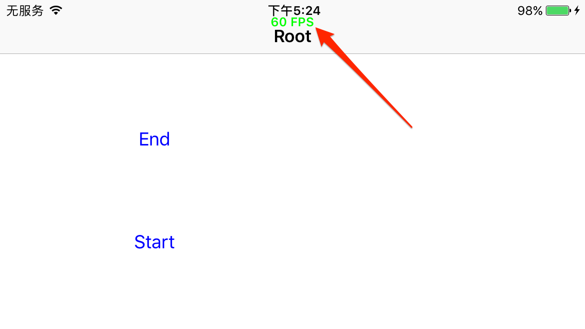

# ALFPSStatus
[English](README.md)
在状态栏显示FPS当前状态

# 如何使用?
* 零配置
* 下载此工程，将ALFPSStatus文件夹拖入到你的工程就行，无须写任何代码。

# 只支持ARC
如果你仍在使用MRC，你就会在编译的时候得到一个编译错误，ALFPSStatus仅仅只有一个类，你可以添加编译标示符-fobjc-arc.

## 支持所有的屏幕方向
不仅仅是支持所有设备方向。而且它还支持在非plus设备上以横屏模式启动应用
## 支持所有的iPhone和iPad
ALFPSStatus支持所有的iPhone、iPad、iPod touch设备
# 注意
只在DEBUG模式下使用ALFPSStatus,Release版本请移除。或者无需任何操作，ALFPSStatus会自动在Release环境中屏蔽相应的功能

# 以下是屏幕截图:

